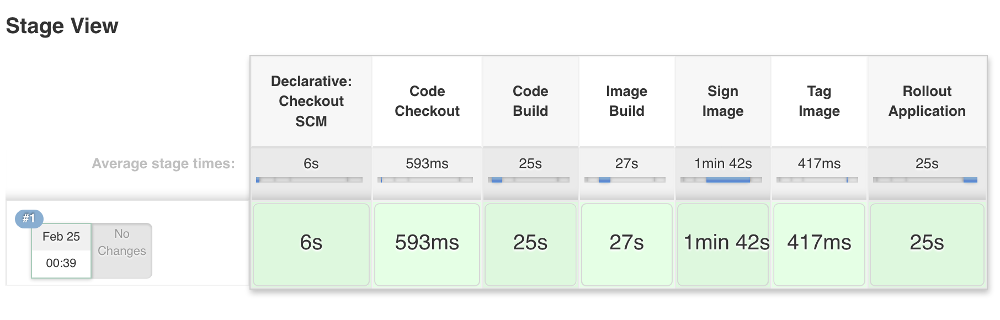

Image Scanning and Signing Service
========================================

_This repository is currently undergoing active development. Functionality may be in flux_

Services to support image scanning and signing on the [OpenShift Container Platform](https://www.openshift.com/container-platform/index.html)

## Overview

The OpenShift Container Platform ecosystem contains mechanisms for securely managing container images. This includes but is not limited to [image signing](https://docs.openshift.com/container-platform/3.6/admin_guide/image_signatures.html) and [image scanning](https://docs.openshift.com/container-platform/3.6/security/container_content.html#security-content-scanning). In addition, the platform also provides users with methods for specifying their intent for actions to be completed. A typical use case includes the creation of applications with certain replica counts. It can also include a desire to have actions, such as a desire to have an image signed or scanned. 

The contents within this repository provide a service for which users declare their intent to scan and sign container images and the service facilitating this process on their behalf.   

## Concepts

### Image Signing

Image signing is a way to apply a digital signature to a container image. This guide describes how an automated process can be created an implemented within OpenShift. The goal is to produce an environment that allows for only the execution of signed images from trusted sources (Red Hat Container Catalog [RHCC]) along with assets that are created within an organization or group.  

### Image Scanning

Image scanning is a process for inspecting the composition of a container image for vulnerabilities or threats. While there are a number of tools on the market today, this guide will describe how image scanning can be utilized to verify the content of images prior to their deployment into a production environment. 

### Self Service Model

One of the key traits of OpenShift is that the platform provides the ability for users to request and provision resources. The ability for a user to declare their intent to scan and sign images is consistent with the capabilities provided by the platform.

## Architecture

The image scanning and signing service takes advantage of two key concepts in the OpenShift ecosystem:

* [Operators](https://coreos.com/operators/) - Method of packaging, deploying, and managing Kubernetes Applications. This application leverages the [Operator SDK](https://github.com/operator-framework/operator-sdk) to streamline the development of Operators.
* [Custom Resource Definitions](https://kubernetes.io/docs/concepts/api-extension/custom-resources/) - An extension of the OpenShift/Kubernetes API that allows users to interact with API objects in a similar manner as _Pods_

When combined with the a Custom Resource Definition, a custom controller can react upon the intents specified by the user and perform a set of actions, such as triggering the scanning and signing of an image.


## Provisioning

The process for building and deploying the infrastructure to support the tooling contained within this repository has been declaratively described through a set of OpenShift configurations and templates. These objects can be applied to an OpenShift environment through the [openshift-applier](https://github.com/redhat-cop/casl-ansible/tree/master/roles/openshift-applier).

### Prerequisites

The following prerequisites must be met in order to deploy the components through the _openshift-applier_:

* Ansible 
* OpenShift Command Line tool
* An OpenShift environment with the ability to create `cluster` level resources

### Deployment

Currently, there are two types of deployments:

* Core infrastructure
* Continuous Integration/Continuous Delivery demonstration (in subsequent section)

Depending on the type of deployment that you are targeting, _filter_tags_ as part of the _openshift-applier_ can be specified as described below.

Complete the following steps to deploy the Image Scanning and Signing Service.

1. Clone this repository to your local machine and navigate into the repository

		git clone https://github.com/sabre1041/image-scanning-signing-service
		cd image-scanning-signing-service
 
2. Run Ansible Galaxy to pull in required Ansible dependencies

		ansible-galaxy install -r requirements.yml -p roles

3. Login to OpenShift cluster as a user with `cluster-admin` rights

		oc login -u <username> https://<openshift-server>

4. Execute provisioning

To deploy  the core infrastructure, specify the Ansible environment variable `-e filter_tags=core` as shown below

		ansible-playbook -i inventory/ roles/casl-ansible/playbooks/openshift-cluster-seed.yml -e filter_tags=core

Confirm the ansible run was successful. A series of builds and deployments will occur within OpenShift. Provisioning will be successful when a pod starting with `image-scanning-signing-service` from the command `oc get pods -n image-management`

## Demonstrations

There are multiple ways to demonstrate image scanning and image signing inaction. 

### Simple Workflow

To facilitate Image Signing, the _image-scanning-signing-service_ makes use of a `ImageSigningRequest` Custom Resource Definition which allows users to declare their intent to have an image signed. This section will walk through the process of signing an image after a new image has been built.

OpenShift provides a number of quickstart templates. One of these templates contains a simple .NET Core web application application. This is an ideal use case to showcase image signing in action.

#### Build an Application

First, create a new project called _dotnet-example_

```
oc new-project dotnet-example
```

Instantiate the _dotnet-example_ template within the project using the default values specified in the template

```
oc new-app --template=dotnet-example
```

Monitor the status of the build triggered by the template instantiation

```
oc get builds
```

When the build completes, the image has been pushed to the OpenShift internal registry and the _latest_ tag is updated on the ImageStream. This can be verified by running `oc get is`

### Declare an Intent to Sign the Image

To declare your intent to sign the previously built image, a new `ImageSigningRequest` can be created within the project. A typical request is shown below

```
apiVersion: cop.redhat.com/v1alpha2
kind: ImageSigningRequest
metadata:
  name: dotnet-app
spec:
  imageStreamTag: dotnet-example:latest
```

As seen in the example above, the key field of note is the name of the object (dotnet-example) and the imageStreamTag (dotnet-example:latest).

A template is available to streamline generating an `ImageSigningRequest` in the `examples/image-signing-request-template.yml` file. Two parameters are required:

* Name of the object to be created
* ImageStreamTag of the image that should be signed in the current project

To create a new `ImageSigningRequest` with the name _dotnet-example_ and the ImageStreamTag _dotnet-example:latest_, execute the following command:

```
oc process -f examples/image-signing-request-template.yml -p IMAGE_SIGNING_REQUEST_NAME=dotnet-example IMAGE_STREAM_TAG=dotnet-example:latest | oc apply -f-
```

Confirm the new `ImageSigningRequest` was successfully created by running `oc get imagesigningrequests`

As soon as the object is created, the controller will create a new signing pod in the _image-management_ project. This can be seen by running `oc get pods -n image-management`. Feel free to track the status of the signing action by viewing the logs from the signing pod. 

Once the pod signing pod completes successfully, the `ImageSigningRequest` will be updated and contain the name of the signed image in the _Status_ section. Confirm this by running `oc get imagesigningrequest dotnet-example -o yaml`.

Finally, the newly created Image will contain the signatures associated with the signing action. This can be confirmed by running the following command:

```
oc get image $(oc get imagesigningrequest dotnet-example --template='{{ .status.signedImage }}') -o yaml
```

Confirm the response contains a _signatures_ section similar to the following:

```
signatures:
- content: owGbwMvMwMRo/+eUg2nAWlHG0we6khiiuks1q5WSizJLMpMTc5SsqpUyU1LzSjJLKkHslPzk7NQi3aLUtNSi1LzkVCUrhFB6ZnFJUaVeSmpaYmlOiV5xWbKVqYGBgX5KfkleaoluYkEBjJlakZhbkJNqlZNYklpcolSro5SZm5ieimRBbmJeZhpQTjclMx2kxEqpOCPRyNTMKik5JckyMcXAwsLQ2CjJwCLFIjnJLM00zdzYMC0x2dLCINXcNMnQwMLc3DQl1dzcyNDc3NwESBskWxoYGpskgiwrqSwAOTyxJD83M1khOT+vJDEzL7VIoTgzPS+xpLQoFaQov6AkMz8PEgLJRalAxUUIPQZ6hnoGuimpZUpA0zJzgS4EekjJytDU0BLoMktj89raTkYZFgZGJgY2ViZQkDJwcQrAAnrvPfb/zjP7ytTT7u1oP/AgZnFN1tuPe3vVjSza18gw/Nx7obY8cmXj/f0rmpR2rX+x7rbf+Un/bzz32vtae76e1vfOQIOCrVZmlfOs09XF31tL5N9qCL4owhHBpRauqyxYMK1oS71OTlVPXf9XHTbf0g1Lmr8u3W+r81y12uM27xbl/mjXi7evdKw8toztsqrmtUqLx1E7aqf/MU959ezao09yvmebY/mYF4Ssq9sga2PkHDi9zjG+N05vsbLDrvP1q6fUTbaxE1JU7t796dll4x5m8Qf1Dy0MFVYwskeJVBtz9Md8eF+fVZkXvHBvxPY7ZWJbP3Vp3wnk2nvcae/Gm6dWLrtnHMs4J3lRrvC/G7cA
  metadata:
    creationTimestamp: 2018-02-20T01:08:57Z
    name: sha256:bcdb9ad088132b08d8cb6f5f731fac980e75b108775de772177747720c90134a@81f1f60851e175e008bba542f3cd443b
    uid: a08ed947-15da-11e8-ae24-fa163e6706b0
  type: atomic
``` 

### Specifying a custom GPG key to utilize

Instead of leveraging the default gpg key that is configured within the cluster, users can specify a separate GPG key to use to sign the image. The GPG key is stored within a secret and injected into the signing pod at runtime.

First, create a new secret within the current project containing the GPG key:

```
oc create secret mygpgkey <directory_containing_gpg_key>
```

Create a new `ImageSigningRequest` which specifies the secret and signer address:

```
apiVersion: "cop.redhat.com/v1alpha2"
kind: ImageSigningRequest
metadata:
  name: dotnet-app-mygpgkey
spec:
  imageStreamTag: "dotnet-example:latest"
  signingKeySecretName: mygpgkey
  signingKeySignBy: custom-openshift@example.com
```

### Declare an Intent to Scan The Image

To declare your intent to scan the previously built image, a new `ImageScanningRequest` can be created within the project. A typical request is shown below

```
apiVersion: cop.redhat.com/v1alpha2
kind: ImageScanningRequest
metadata:
  name: dotnet-app
spec:
  imageStreamTag: dotnet-example:latest
```

As seen in the example above, the key field of note is the name of the object (dotnet-example) and the imageStreamTag (dotnet-example:latest).

A template is available to streamline generating an `ImageScanningRequest` in the `examples/image-scanning-request-template.yml` file. Two parameters are required:

* Name of the object to be created
* ImageStreamTag of the image that should be scanned in the current project

To create a new `ImageScanningRequest` with the name _dotnet-example_ and the ImageStreamTag _dotnet-example:latest_, execute the following command:

```
oc process -f examples/image-scanning-request-template.yml -p IMAGE_SCANNING_REQUEST_NAME=dotnet-example IMAGE_STREAM_TAG=dotnet-example:latest | oc apply -f-
```

Confirm the new `ImageScanningRequest` was successfully created by running `oc get imagescanningrequests`

As soon as the object is created, the controller will create a new scanning pod in the _image-management_ project. This can be seen by running `oc get pods -n image-management`. Feel free to track the status of the scanning action by viewing the logs from the scanning pod. 

Once the scan completes, a WebDav server is started within the pod to host the reports. The controller will communicate with the pod and retrieve the results. The `ImageSigningRequest` will be updated and contain the statistics from the scan in the _scanResult_ section of the _Status_ section. Confirm this by running `oc get imagescanningrequest dotnet-example -o yaml`.

Finally, the newly created Image will contain the results associated with the scanning action. This can be confirmed by running the following command:

``
oc get imagescanningrequest dotnet-example -o yaml
```

Confirm the response contains a _signatures_ section similar to the following:

```
status:
  conditions:
  - lastTransitionTime: 2018-07-16T14:34:20Z
    message: Scanning Pod Launched 'image-management/42b15f17-8905-11e8-961e-fa163e236d0f'
    status: "True"
    type: Initialization
  - lastTransitionTime: 2018-07-16T14:35:04Z
    message: Image Scanned
    status: "True"
    type: Finished
  endTime: 2018-07-16T14:35:04Z
  phase: Completed
  scanResult:
    failedRules: 2
    passedRules: 659
    totalRules: 661
  startTime: 2018-07-16T14:34:20Z
``` 

Notice the _scanResult_ field which contains the results of the scan. 

### Continuous Integration and Continuous Delivery

This example demonstrates how to leverage image scanning and signing as part of a Continuous Integration and Continuous Delivery pipeline. 

#### Provisioning

Similar to the deployment of the core infrastructure, this demonstration can be provisioned using the OpenShift applier by specifying the `-e filter_tags=pipeline` Ansible environment variable.

Execute the following command to provision the components:

		ansible-playbook -i inventory/ roles/casl-ansible/playbooks/openshift-cluster-seed.yml -e filter_tags=pipeline

Once complete, a new project called `image-scanning-signing-pipeline` which will contain a Jenkins server along with application build (_JenkinsPipeline_ and _Binary S2I_) along with deployment objects.

Triggers have been enabled on the Jenkins pipeline so a build will be triggered automatically. 

Login to the OpenShift web console and select the _Image Scanning and Signing Pipeline_ project. View running pipelines by hovering over _Builds_ on the lefthand navigation bar and select **Pipelines**. 

Under _Build #1_, select **View Log** which will redirect to the Jenkins instance which was deployed. 

You can view the progress of the build log. Otherwise, select **Back to Project** on the lefthand navigation links to view the overall state of the builds. 

As it progresses through the pipeline, the following actions will occur:

* Code build
* Image build
* Image scanning and signing actions
* Application deployments

Once successful, the stage view will appear similar to the following:



Back within the OpenShift web console, locate the address of the exposed _Route_ to access the application by hovering over _Applications_  on the lefthand navigation bar and selecting **Routes**. Click on the URL provided underneath _Hostname_.

To learn more about the underlying steps that are executed within the pipeline, browse through the included [Jenkinsfile](ci/Jenkinsfile).